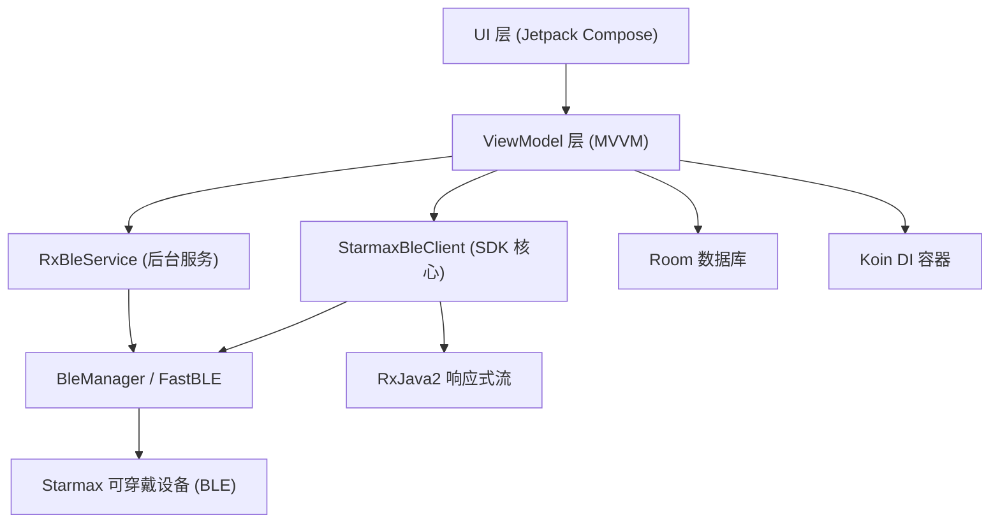
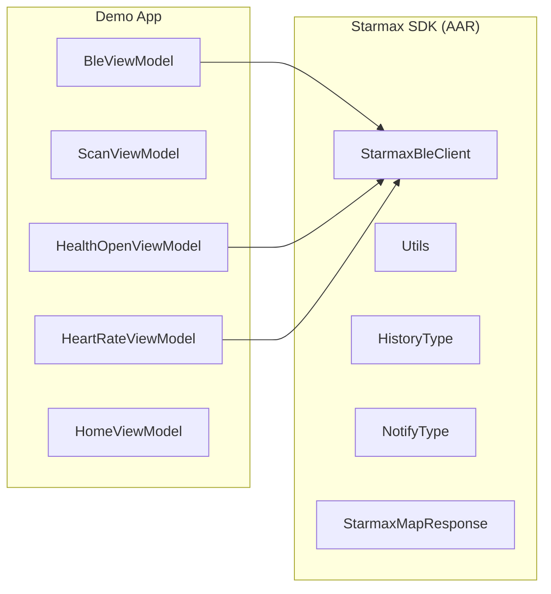
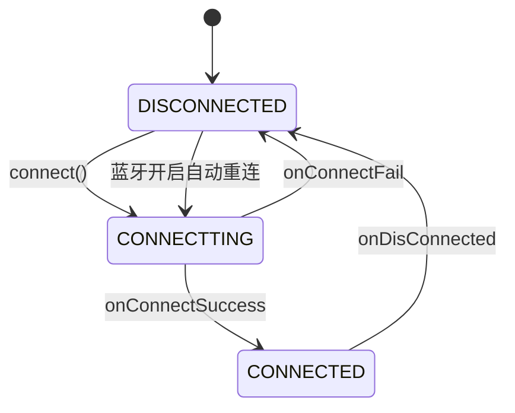

# Starmax Android SDK 调研报告

> **项目路径：** `d:/search/androidsdksimple20250306/androidsdksimple/StarmaxDemo`  
> **调研日期：** 2026-02-26  
> **报告作者：** Antigravity AI 助理

---

## 一、项目概述

**StarmaxDemo** 是 Starmax 可穿戴设备（智能手表/手环）配套的 Android SDK 示例工程。其核心目标是通过蓝牙低功耗（BLE）与 Starmax 设备通信，实现健康数据采集、设备管理与 OTA 固件升级等功能。该工程同时也是面向第三方开发者的集成参考实现。

```
应用包名: com.starmax.sdkdemo
应用版本: 1.0 (versionCode 2)
最低 Android 版本: API 21 (Android 5.0, Lollipop)
目标 Android 版本: API 34 (Android 14)
```

---

## 二、技术架构

### 2.1 整体架构图



### 2.2 技术栈

| 层次 | 技术选型 |
|------|----------|
| UI 框架 | Jetpack Compose + Material3 |
| 架构模式 | MVVM + Jetpack ViewModel |
| 依赖注入 | Koin 3.4 |
| 响应式编程 | RxJava2 / RxKotlin |
| BLE 通信 | FastBLE 2.4.0 |
| 数据通信协议 | Protobuf (protobuf-javalite 3.18.1) |
| 本地存储 | Room 2.3.0 |
| 网络 | OkHttp 4.9.0 |
| 导航 | Jetpack Navigation Compose |
| 语言 | Kotlin (JVM 17) |
| 编译 SDK | Android 34 |

### 2.3 模块依赖关系



> SDK 核心库以本地 AAR/JAR 方式引入：`src/main/libs/`，通过 `fileTree` 依赖配置。

---

## 三、核心功能分析

### 3.1 BLE 连接管理（BleViewModel）

BLE 连接生命周期由 `BleViewModel` 统一管理，状态机如下：



**关键实现细节：**
- 使用 NUS 服务（Nordic UART Service）协议进行数据读写
  - 写特征 UUID：`6e400002-b5a3-f393-e0a9-e50e24dcca9d`
  - 通知特征 UUID：`6e400003-b5a3-f393-e0a9-e50e24dcca9d`
- 支持 **Notify** 和 **Indicate** 两种通知模式（可切换）
- 连接成功后自动协商 MTU（目标 512，实际 `mtu-3` 的字节为分片写入大小）
- 通过 `BroadcastReceiver` 监听系统蓝牙开关状态，实现掉线后自动重连

### 3.2 设备扫描与广播解析（ScanViewModel）

扫描功能支持**按设备名**和**按 MAC 地址**两个维度过滤。更重要的是，该 SDK 实现了对多种 Starmax 设备广播包格式的解析，支持直接从广播中读取健康数据（**无需建立连接**）：

| 广播类型标识 | 格式说明 | 可读数据 |
|------------|---------|---------|
| `0xFF 0xEE` (单字节) | 标准 Starmax 广播 | SN、蓝牙名、心率、步数、血压、血氧、血糖、温度、MAI、梅脱、压力、卡路里、电量 |
| `0xFF 0x00 0x01` | 通用格式 | 基础识别 |
| `0xFF 0x00 0x02 0xAA 0xEE` | 扩展标准广播 | SN + 全量健康数据 |
| `0xFF 0x00 0x02 0xBB 0xEE` | 电源诊断广播 | BATB、ADC、电量级别 |
| `0xFF 0x00 0x02 0xAA 0x55` | PID 版本广播 | PID + 健康数据 |
| `0xFF 0xAA 0xEE` (20字节) | 加速度广播 | X/Y/Z 轴加速度、心率、血氧、温度 |
| `0xFF 0xAA 0xEE` (其他) | 标准宽广播 | 同 0xEE 格式 |
| `0xFF 0xA2 0x0A` | Care Bloom 格式 | 产品类型、固件版本、信号强度、加速度方向、全量健康指标 |
| `0x01` 类型 `0x0A` | 一键双连标识 | 支持双模蓝牙标志 |

> **亮点：** 广播解析粒度极细，可在不建立 BLE 连接的情况下实时获取用户健康数据，大幅降低电量消耗。

### 3.3 健康数据能力（HealthOpenViewModel）

通过 `StarmaxBleClient.getHealthOpen()` / `setHealthOpen()` 可查询和配置以下传感器的**持续监测开关**：

- ✅ 心率（Heart Rate）
- ✅ 血压（Blood Pressure）
- ✅ 血氧（Blood Oxygen / SpO₂）
- ✅ 压力（Stress）
- ✅ 皮肤温度（Body Temperature）
- ✅ 血糖（Blood Sugar）
- ✅ 呼吸率（Respiration Rate）

### 3.4 心率控制（HeartRateViewModel）

提供精细化的心率测量控制接口：
- 设置自动测量**时间窗口**（开始/结束时/分）
- 设置测量**采样间隔**（period，单位：分钟）
- 设置心率**报警阈值**（alarmThreshold）

### 3.5 历史健康数据查询（BleViewModel）

```kotlin
// 查询有效历史数据日期
StarmaxBleClient.instance?.getValidHistoryDates(HistoryType.HeartRate)

// 查询指定日期心率历史
StarmaxBleClient.instance?.getHeartRateHistory(calendar)
// 返回：采样间隔、日期、数据列表（时:分 + 心率值）
```

### 3.6 设备信息与版本管理

`getVersion()` 可查询设备的详细信息：

| 字段 | 说明 |
|------|------|
| model | 设备型号 |
| version | 固件版本 |
| uiVersion | UI 版本 |
| bufferSize | 设备接收缓冲区大小 |
| lcdWidth/lcdHeight | LCD 分辨率 |
| screenType | 屏幕类型 |
| protocolVersion | 通信协议版本 |
| supportSugar | 是否支持血糖检测 |
| sleepVersion | 睡眠算法版本 |
| sleepShowType | 睡眠展示方式 |
| supportSleepPlan | 是否支持睡眠计划 |
| uiForceUpdate | UI 是否强制升级 |
| uiSupportDifferentialUpgrade | 是否支持差分升级 |

### 3.7 OTA 固件升级

- 集成 `com.realsil.sdk.dfu.DfuService`（Realtek DFU 服务）
- 支持图片资源升级（imageUri）和固件升级（binUri）
- 支持**差分升级**（uiSupportDifferentialUpgrade）
- 升级文件下载路径：`/sdcard/Android/data/.../SDKDemo/Device_update/`

### 3.8 设备绑定

支持三种蓝牙类型的设备绑定：
- **LE 蓝牙**（BLE only）
- **经典蓝牙**（BR/EDR）  
- **双模蓝牙**（通过反射调用 `createBond(transport)` 实现）

---

## 四、权限声明分析

```xml
<!-- BLE 连接相关（Android 12+） -->
BLUETOOTH_SCAN, BLUETOOTH_ADVERTISE, BLUETOOTH_CONNECT

<!-- BLE 连接相关（Android 11 及以下，向后兼容） -->
BLUETOOTH, BLUETOOTH_ADMIN (maxSdkVersion=30)

<!-- 位置（BLE 扫描依赖） -->
ACCESS_FINE_LOCATION

<!-- 存储（OTA 固件下载） -->
WRITE_EXTERNAL_STORAGE, READ_EXTERNAL_STORAGE, MANAGE_EXTERNAL_STORAGE

<!-- 网络（固件下载、在线服务） -->
INTERNET

<!-- 后台服务（长连接保活） -->
FOREGROUND_SERVICE

<!-- 通知 -->
POST_NOTIFICATIONS (optional)

<!-- 音频 -->
MODIFY_AUDIO_SETTINGS
```

> **安全注意：** `MANAGE_EXTERNAL_STORAGE` 属于高危权限，Google Play 需要填写声明理由。建议改用应用私有目录存储 OTA 固件。

---

## 五、依赖库说明

| 库名 | 版本 | 用途 |
|------|------|------|
| FastBLE | 2.4.0 | BLE 扫描/连接/读写封装 |
| Koin | 3.4.x | 依赖注入框架 |
| RxJava2 + RxKotlin | 2.x | SDK 响应式数据流 |
| Protobuf Javalite | 3.18.1 | BLE 通信协议序列化 |
| Room | 2.3.0 | 本地健康数据持久化 |
| OkHttp | 4.9.0 | 固件/资源网络下载 |
| Jetpack Compose | 1.2.x | 现代声明式 UI |
| Material3 | 1.0.0-beta01 | Material Design 3 |
| Navigation Compose | 2.5.2 | 页面路由导航 |
| Realtek DfuService | 内置 | OTA 固件升级 |

---

## 六、已知问题与优化建议

### 6.1 代码质量问题

| 问题 | 位置 | 建议 |
|------|------|------|
| `TODO("Not yet implemented")` 未实现异常 | `BleViewModel.getRssi()` 中 onRssiFailure | 补充错误处理逻辑 |
| `minifyEnabled false` | `build.gradle` release 配置 | 正式发布时应开启代码混淆+压缩 |
| `@SuppressLint("MissingPermission")` | BLE 回调中 | 运行时需确保权限已申请 |

### 6.2 安全性建议

- 移除 `android:usesCleartextTraffic="true"`，强制使用 HTTPS
- 减少 `MANAGE_EXTERNAL_STORAGE` 权限申请，改用 Scoped Storage
- 对 BLE 数据包进行防重放攻击校验

### 6.3 架构优化建议

- **依赖库版本升级：** Room 升至 2.6+，Compose 升至 1.5+，Material3 升至稳定版
- **后台保活：** 当前通过 `FOREGROUND_SERVICE` 保活，建议评估 WorkManager 在低功耗场景下的适用性
- **历史数据同步：** 建议在 `RxBleService` 中实现全量历史数据的分页同步与本地缓存策略
- **错误重试机制：** BLE 写操作失败时目前无重试逻辑，建议引入指数退避重试

### 6.4 扩展能力

- 广播格式表明设备支持**摇一摇**、**抬腕**、**上课模式**等交互功能，可在 Demo 中进一步暴露
- 支持 `NotifyType` 等枚举类型，说明 SDK 支持多种推送通知类型（天气、消息、来电等），可在 UI 中完整演示

---

## 七、总结

Starmax Android SDK 是一个功能成熟、覆盖面广的可穿戴设备通信中间件。其核心优势在于：

1. **广播解析能力强**：无需连接即可获取设备健康实时数据
2. **健康传感器覆盖全**：心率、血压、血氧、血糖、体温、压力、呼吸率一应俱全
3. **MVVM + 响应式架构**：代码结构清晰，易于集成和扩展
4. **OTA 升级完整**：支持差分升级和图片资源升级

主要改进空间在于权限收敛、代码安全加固、依赖版本现代化，以及对部分未完成功能（RSSI 错误处理）的补全。

---

*本报告基于 `StarmaxDemo` 工程源码静态分析生成，不包含运行时测试数据。*
